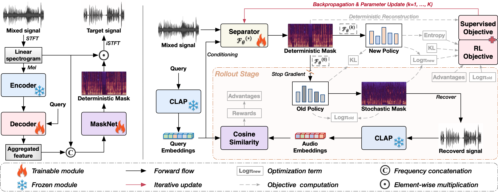

<div align="center">
  <h1>QSep-RL</h1>

  <p>
    <strong>Xincheng Yu, Shizhong Zhou, Jiankun Li, Ting Lei, Jianwei Zhang, and Yi Lin*</strong>
  </p>

  <p>
    <a href="#"></a>
    <a href="https://XCYu-0903.github.io/QSep-RL-demo/"></a>
    <a href="https://github.com/XCYu-0903/QSep-RL"></a>
    <a href="https://huggingface.co/Ediethia/QSep-RL/tree/main"></a>
  </p>
</div>


## Architecture

<div align="center">
  
</div>

## Structure

-  `train_qseprl.py`: Training entry. It supports training from scratch and resuming from split checkpoints.
-  `config.json`: Default config template.
-  `model/QSepRL_backbone`: QSep-RL backbone (w/o RL), which supports inference applications.
-  `model/QSepRL`: QSep-RL with RL, which will be made available concurrently with the release of `train_qseprl.py`.
-  `best.pt`: Released checkpoint.
-  `inference.py`: Extracting target sound through given queries.
-  `data_utils/`: AudioCaps mixture dataset utilities.
-  `scripts/prepare_audiocaps_json.py`: Converting AudioCaps metadata and local audio paths into JSON files used by training.

## Prerequisites

QSep-RL requires Python >= 3.8. Please install the required packages according to `requirements.txt`.

## Prepare AudioCaps JSON

The training code expects JSON metadata with this schema:

```json
[
  {
    "file_name": "example.wav",
    "path": "/absolute/path/to/example.wav",
    "caption": "a dog barking",
    "mids": "",
    "class_names": ""
  }
]
```

Generate train and validation JSON files from AudioCaps CSV files:

```bash
python scripts/prepare_audiocaps_json.py \
  --audiocaps_csv /path/to/audiocaps_train.csv \
  --audio_root /path/to/AudioSet \
  --output_json metadata/audiocaps_train.json \
  --missing_json metadata/audiocaps_train_missing.json

python scripts/prepare_audiocaps_json.py \
  --audiocaps_csv /path/to/audiocaps_val.csv \
  --audio_root /path/to/AudioSet \
  --output_json metadata/audiocaps_val.json \
  --missing_json metadata/audiocaps_val_missing.json
```

If you use ontology filtering, place the AudioSet ontology JSON at the path configured by `ontology_path` in `experiments/QSep-RL/config.json`.

## Training

Defaults are defined in `train_qseprl.py`. Values in `experiments/QSep-RL/config.json` override those defaults, and command-line arguments override both. By default, RL and GRPO are enabled and the copied encoder uses trainable LoRA.

For multi GPUs run:

```bash
torchrun --nproc_per_node=2 train_qseprl.py \
  --exp_dir ./experiments/QSep-RL \
  --run_name qseprl
```

For a single GPU quick run:

```bash
python train_qseprl.py \
  --exp_dir ./experiments/QSep-RL \
  --run_name qseprl_debug \
  --batch_size 32
```

## Resume

Resume from the latest split checkpoint under `cp/<run_name>`:

```bash
python train_qseprl.py \
  --exp_dir ./experiments/QSep-RL \
  --run_name qseprl \
  --auto_resume true
```

Edit `experiments/QSep-RL/config.json` to set `clap_path`, `input_dir`, metadata JSON paths, and ontology path for your machine.

## Inference

For quick inference, download the released QSep-RL checkpoint and CLAP checkpoint from [Hugging Face](https://huggingface.co/Ediethia/QSep-RL/tree/main), and place them under `cp/`.

Run:

```bash
python inference.py \
  --audio_path 'example.wav' \
  --query 'A girl laughs while a dog letting out a lower rumble with a sharp barking and a continuous growling' \
  --negative_query 'A man speaks to give instructions loudly' \
  --output_path 'target.wav' \
  --exp_dir './experiments/QSep-RL' \
  --checkpoint_path './cp/best.pt' \
  --clap_path './cp/music_audioset_epoch_15_esc_90.14.pt'
```

**[NOTE]** The current inference pipeline uses 10-second chunks by default. Audio longer than 10 seconds will be split into chunks and concatenated after separation. You can change the chunk duration with the `--duration` argument, or modify the inference logic to use a sliding-window strategy.


## Acknowledgements

We referred to [CLAPSep](https://github.com/Aisaka0v0/CLAPSep) and [MARS-Sep](https://github.com/mars-sep/MARS-Sep) to implement this.

## Contact Us

If you are interested in leaving a message to our research team, feel free to email xinchengyu@alu.scu.edu.cn.

<p align="center">
  
  &nbsp;&nbsp;&nbsp;&nbsp;
  
</p>
